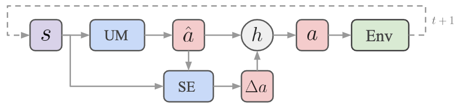

# Towards Safe Reinforcement Learning with a Safety Editor Policy

<p align="center">
    
</p>

[Update Dec 07, 2023]: Now SEditor is [part](https://github.com/HorizonRobotics/alf/blob/pytorch/alf/algorithms/seditor_algorithm.py) of the official ALF repo! You just need to checkout the
latest 'pytorch' branch of ALF to use SEditor.

---

This repo contains the training configurations for the experiments in

> Towards Safe Reinforcement Learning with a Safety Editor Policy, Yu et al., arXiv 2022.

We also provide instructions on how to run those experiments.

## What is SEditor?

A typical approach in safe RL research is to combine a model-free RL algorithm with the Lagrangian method to adjust the weight of the constraint reward relative to the utility reward dynamically. It relies on a single policy to handle the conflict between utility and constraint rewards, which is often challenging.

SEditor is a two-policy approach that learns a safety editor policy transforming potentially unsafe actions proposed by a utility maximizer policy into safe ones. The safety editor is trained to maximize the constraint reward while minimizing a hinge loss of the utility state-action values before and after an action is edited. SEditor extends existing safety layer designs that assume simplified safety models, to general safe RL scenarios where the safety model can in theory be arbitrarily complex. As a first-order method, it is easy to implement and efficient for both inference and training.

On 12 Safety Gym tasks and 2 safe racing tasks, SEditor demonstrates outstanding utility performance with constraint violation rates as low as once per 2k time steps, even in obstacle-dense environments. On some tasks, this low violation
rate is up to 200 times lower than that of an unconstrained RL method with similar utility performance.

## Installation

Our algorithm is based on [Agent Learning Framework (ALF)](https://github.com/HorizonRobotics/alf). Python3.7+ is currently supported by ALF and [Virtualenv](https://virtualenv.pypa.io/en/latest/) is recommended for the installation. After activating a virtual env, download and install ALF:

```bash
git clone https://github.com/HorizonRobotics/alf
cd alf
git checkout origin/pytorch -B main
# If for any reason the latest 'pytorch' branch doesn't work, you can checkout the
# commit '26be03eb61f59a71f561ab0145671cee674d450f' instead
# As of Jan 2024, ALF uses torch==1.11 which by default has cuda==10.2. For recent
# GPU cards (3090 and after), cuda>=11.3 is needed.
pip install -e . --extra-index-url https://download.pytorch.org/whl/cu113
# With an old GPU card, you might just do:
# pip install -e .
```

On top of the basic ALF installation,

- [MuJoCo](https://github.com/deepmind/mujoco) (C library) version 2.1+ has to be first downloaded and set up. Please follow their websites for instructions. This is required by safety-gym as it depends on OpenAI's deprecated [mujoco_py](https://github.com/openai/mujoco-py).

- our customized Safety Gym environment then needs to be installed:

    ```bash
    git clone https://github.com/hnyu/safety-gym.git
    pip install -e safety-gym
    python -c "import safety_gym" # test if correctly installed
    ```

After the installations, clone this repo under ALF:

```bash
cd <ALF_ROOT>/alf/examples/safety
git clone https://github.com/hnyu/seditor
```

#### Troubleshooting

Depending on your OS environment, some more apt packages might be needed for
installation. Please refer to the [docker file](https://github.com/hnyu/seditor/blob/main/Dockerfile)
for possible missing packages.

## Docker

For convenience, we provide a docker image that has all softwares ready for
running an SEditor training job, so that you can skip the above installation steps.

```bash
docker pull horizonrobotics/misc:seditor
```

The docker image has python3.8, CUDA 11.3, and pytorch 11.1, which also supports
the SEditor training code as tested.

## Training SEditor

Training on the Safety Gym tasks:

```bash
cd <ALF_ROOT>/alf/examples
python -m alf.bin.train --root_dir=<TRAIN_JOB_DIR> --conf safety/seditor/seditor_safety_gym_conf.py --conf_param="create_environment.env_name='Safexp-PointGoal1-v0'"
```

where `<TRAIN_JOB_DIR>` is any empty directory for storing the training results. You can replace the value of ``create_environment.env_name`` with any combination ``'Safexp-<ROBOT><TASK><LEVEL>-v0'``, where ``<ROBOT>`` can be either ``Point`` or ``Car``, ``<TASK>`` can be ``Button``, ``Push``, or ``Goal``, and ``<LEVEL>`` can be either ``1`` or ``2``.

Then open the Tensorboard to view the training results

```bash
tensorboard --logdir=<TRAIN_JOB_DIR>
```

Alternatively, training on the safe racing tasks:


```bash
cd <ALF_ROOT>/alf/examples
python -m alf.bin.train --root_dir=<TRAIN_JOB_DIR> --conf safety/seditor/seditor_safe_car_racing_conf.py --conf_param="create_environment.env_name='SafeCarRacing<LEVEL>-v0'"
```

where ``<LEVEL>`` can be either ``0`` or ``1``, representing "SafeRacing" and "SafeRacingObstacle" tasks in the paper, respectively.

## Code reading

The entire SEditor algorithm is implemented in this [file](https://github.com/HorizonRobotics/alf/blob/pytorch/alf/algorithms/seditor_algorithm.py), and the Lagrangian multiplier method is implemented [here](https://github.com/HorizonRobotics/alf/blob/pytorch/alf/algorithms/lagrangian_reward_weight_algorithm.py). Some basic understanding of ALF is required to understand the entire pipeline.

## Issue reporting
For any question or problem, please open an issue in this repo.

## Citation
If you use SEditor in the research, please consider citing

```
@article{Yu2022SEditor,
    author={Haonan Yu and Wei Xu and Haichao Zhang},
    title={Towards Safe Reinforcement Learning with a Safety Editor Policy},
    journal={arXiv},
    year={2022}
}
```
